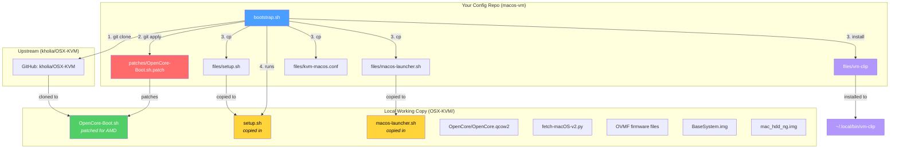
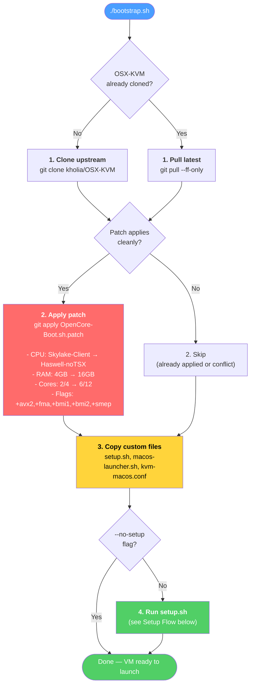
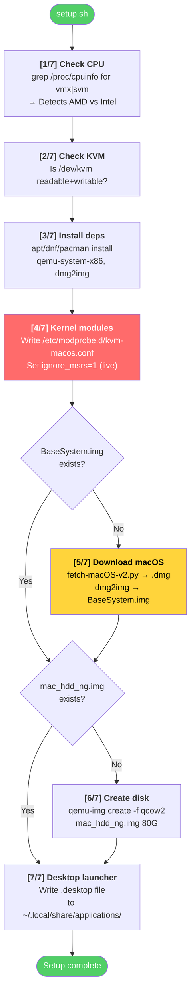
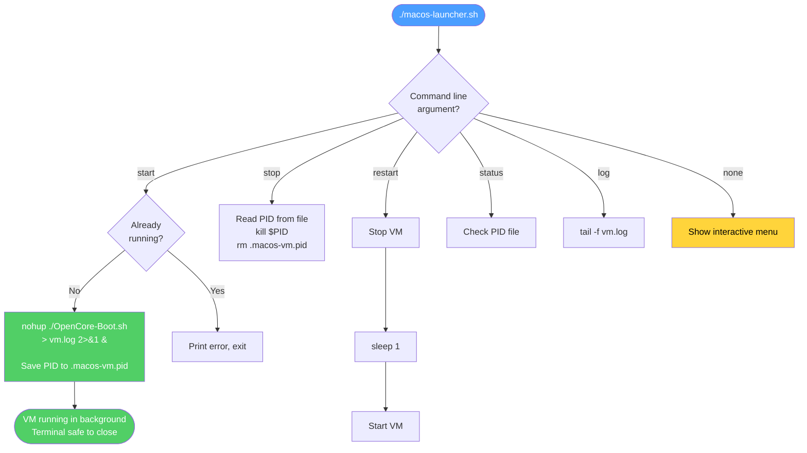
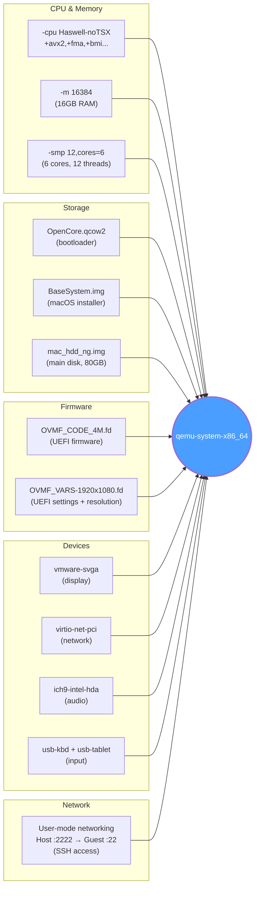
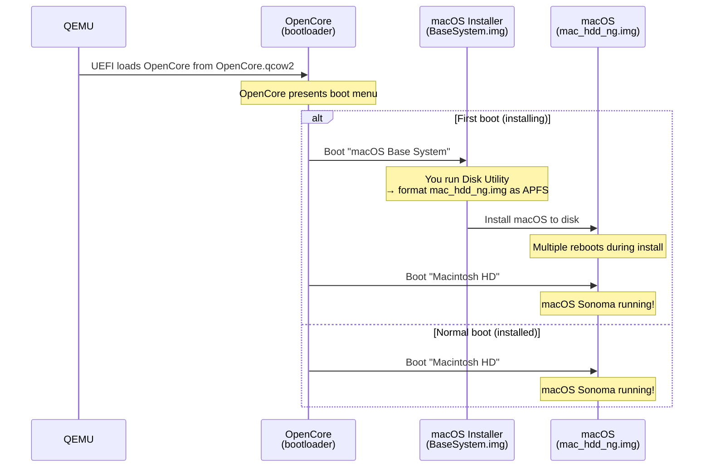
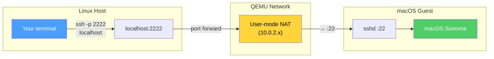
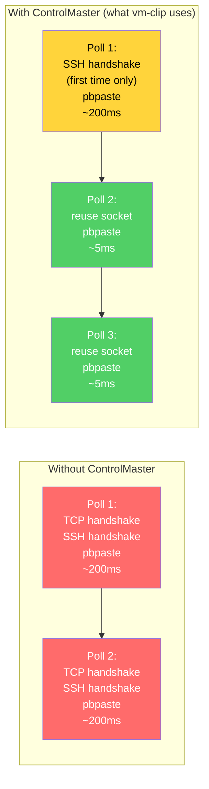
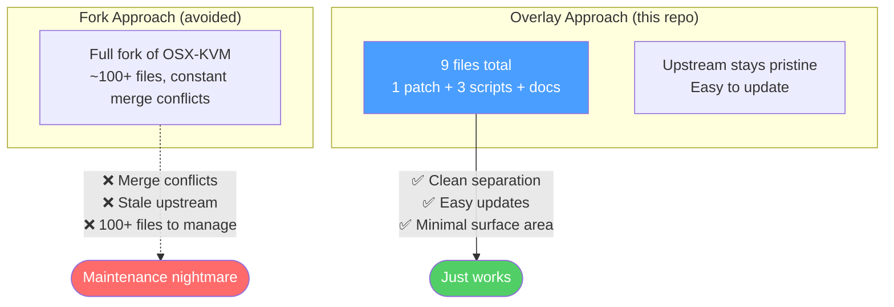
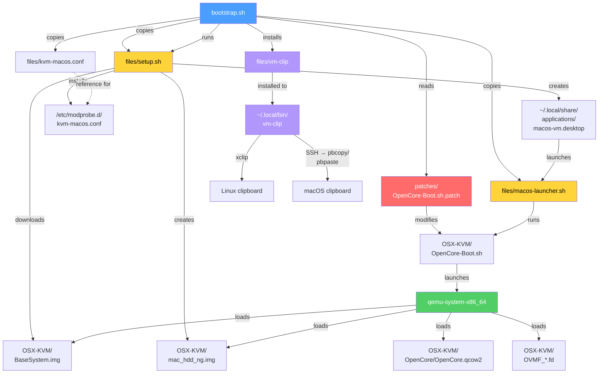

# How It All Works

This doc walks through the entire system — what each piece does, how they connect, and what happens at every stage from first clone to a running macOS VM.

## The Big Picture



## Bootstrap Flow

When you run `./bootstrap.sh`, here's what happens step by step:



## Setup Flow

`setup.sh` handles all the one-time installation work:



## VM Launch Flow

`macos-launcher.sh` manages the VM lifecycle:



## What QEMU Actually Runs

When the VM starts, `OpenCore-Boot.sh` assembles a big `qemu-system-x86_64` command. Here's what each piece does:



## The Boot Chain

When the VM starts, this is the boot sequence:



## Network: Talking to the VM



## Clipboard Sharing: vm-clip

`vm-clip` provides seamless bidirectional clipboard sync between the Linux host and macOS VM. No special agent needed on the macOS side — it uses `pbcopy`/`pbpaste` over SSH.

### How It Works

```mermaid
sequenceDiagram
    participant HC as Linux Clipboard<br>(xclip)
    participant LOOP as vm-clip<br>(bash loop)
    participant SSH as SSH ControlMaster<br>(persistent connection)
    participant MC as macOS Clipboard<br>(pbcopy/pbpaste)

    Note over LOOP: Polls every 500ms

    loop Every 500ms
        LOOP->>HC: Read host clipboard (xclip -o)
        LOOP->>SSH: Read VM clipboard (pbpaste)
        SSH->>MC: pbpaste
        MC-->>SSH: "current text"
        SSH-->>LOOP: "current text"

        alt Host clipboard changed
            LOOP->>SSH: Write to VM (pbcopy)
            SSH->>MC: pbcopy
            Note over MC: Cmd+V now has<br>the Linux text
        else VM clipboard changed
            LOOP->>HC: Write to host (xclip)
            Note over HC: Ctrl+V now has<br>the macOS text
        end
    end
```

### Why It Feels Instant



### Commands

| Command | What it does |
|---------|-------------|
| `vm-clip sync` | Start background daemon — copies flow both directions automatically |
| `vm-clip push` | One-shot: host clipboard → VM |
| `vm-clip pull` | One-shot: VM clipboard → host |
| `vm-clip stop` | Kill the background sync |
| `vm-clip status` | Check if sync is running |

## Why Not Just Fork?



## File Relationship Map

How every file in the repo relates to every other file:



## Summary

| Layer | What | Files |
|-------|------|-------|
| **Config repo** | Your customizations, stored in git | `bootstrap.sh`, `patches/*`, `files/*` |
| **Upstream clone** | The full OSX-KVM toolkit (OpenCore, OVMF, scripts) | Cloned into `OSX-KVM/` at bootstrap time |
| **System config** | Kernel module params for KVM | `/etc/modprobe.d/kvm-macos.conf` |
| **Runtime** | QEMU process running macOS | `qemu-system-x86_64` launched by `macos-launcher.sh` |
| **Clipboard** | Bidirectional sync over SSH | `vm-clip sync` (polls xclip + pbcopy/pbpaste) |

The key insight: you only version-control **your changes** (the patch + helper scripts), not the entire upstream project. When upstream updates, you re-run bootstrap and the patch applies on top of the latest code.
